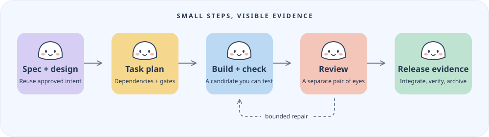
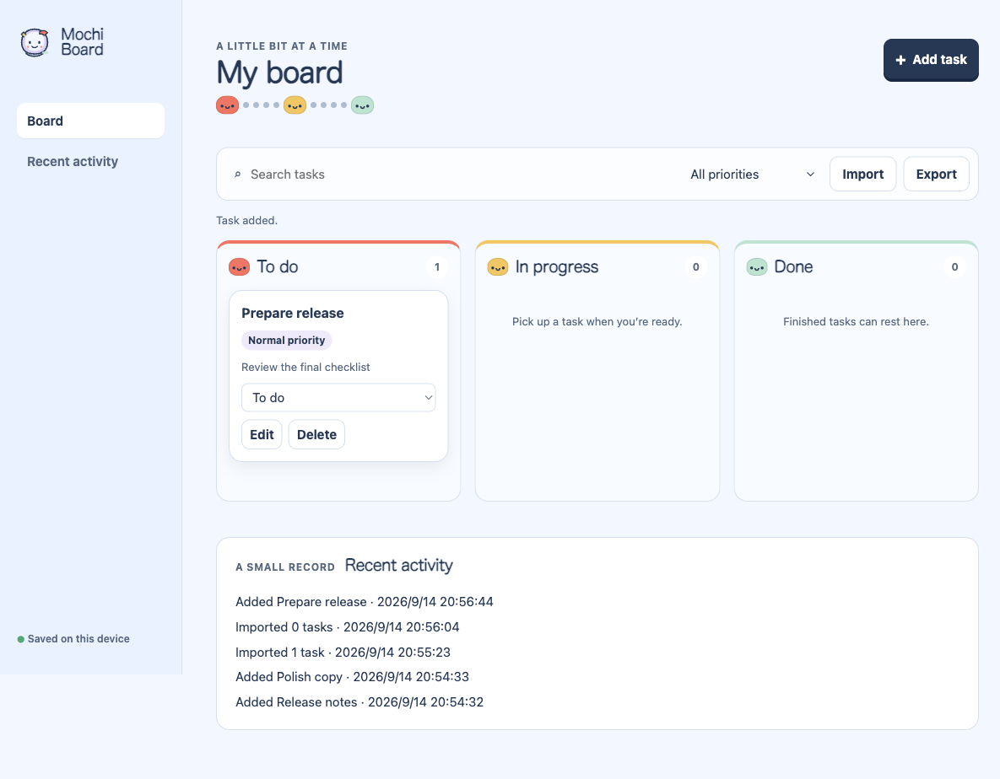

<p align="center">
  
</p>

<h1 align="center">Leo Dev</h1>
<p align="center"><strong>One development entry. Work you can pick up and verify.</strong></p>
<p align="center">Codex first · TypeScript + Node.js · Private project</p>

Leo Dev helps a coding agent carry an approved idea through design, implementation, checks, review and delivery. It reuses selected upstream methods and keeps task state, evidence and recovery in one local lifecycle controller.

Call **`$develop`** in a Codex session. Keep your existing specification, use the methods the task needs, and get a delivery report that distinguishes passed checks from work that was not run.

<p align="center">
  
</p>

## Why it exists

- **Keep approved intent.** Continue from the project's existing specification instead of repeating discovery.
- **Make substantial work reviewable.** Plans carry dependencies and checks; Standard and Full tasks require design and independent review evidence.
- **Recover carefully.** Versioned candidates, leases and an append-only journal help identify stale evidence and interrupted work.
- **Repair with a limit.** Gate failures and rejected reviews share a bounded repair budget, followed by a fresh-context debugging attempt.
- **Deliver evidence.** Aggregate integration, independent verification, artifact hashes and a retrospective support archival. A task marked done is not a release claim by itself.

Leo Dev is a workflow and local integrity mechanism. Your host's sandbox, permissions and external CI remain authoritative. See [security boundaries](SECURITY.md).

## Start from source

Prerequisites: **Node.js 20 or newer**, npm, Git, and Codex for the host workflow. The example app uses Node built-ins and needs no additional packages. Superpowers and relevant UI/browser skills are selected from the host's available skill catalog; missing capabilities must be reported.

```sh
git clone https://github.com/leopaisen-zb/leo-dev.git
cd leo-dev
npm ci
npm run build
npm run typecheck
npm test
npm run build:adapters
npm run verify:packages
npm run build:marketplace
```

The repository is private; cloning requires access. `dist/codex/leo-dev` contains the portable skill, selected upstream resources and the compiled controller runtime. The generated local marketplace contains a copy of that complete package.

Install the generated package using the documented commands in [the installation guide](docs/installation.md). Source compilation, package integrity and an actual new Codex session are separate checks; their recorded outcomes are in [release evidence](docs/release-evidence.md).

## Use the workflow

```text
$develop Build the approved feature in this repository.
Reuse the existing specification, complete the implementation and checks,
get an independent review, and report the actual evidence.
```

For an interrupted task:

```text
$develop Continue the current change.
Inspect durable state and the actual working tree before taking a new lease.
Preserve unrelated edits and do not reuse stale review evidence.
```

Small, clear edits use proportionate checks. Substantial work uses the existing project spec, an explicit task plan and the applicable risk policy. The controller serializes tasks; host subagents provide real implementation and review sessions. It does not start a background agent service.

See the [lifecycle and command guide](skills/develop/references/lifecycle.md), [Codex team recipe](skills/develop/references/codex-team.md), and [review protocol](skills/develop/references/review-protocol.md).

## Meet Mochi Board

A little localhost task board is included as a substantial development exercise: persistent tasks, three workflow columns, priority and text filters, import/export, and recent activity.

<p align="center">
  
</p>

The same board adapts to a [390-pixel mobile viewport](assets/mochi-board-mobile.png). Both images come from the independent browser acceptance run.

```sh
node examples/mochi-board/server.mjs
```

Open `http://127.0.0.1:4173`. Data stays in the example's local `.data/` directory. To use a different file or port:

```sh
node examples/mochi-board/server.mjs --port 4174 --data /absolute/path/board.json
```

The [example requirements](examples/mochi-board/docs/spec-v2.md) and independent acceptance checks make the behavior reproducible. The workflow exercise also checks review rejection and repair, interrupted work and conservative specification revision. See [the recorded results](docs/release-evidence.md) for what was actually executed.

## How it relates to mature workflows

Leo Dev selects methods for each stage and retains one coordinator:

| Source | Use in Leo Dev |
| --- | --- |
| [Superpowers](https://github.com/obra/superpowers) | External methods for planning, TDD, debugging, review and verification. |
| [cc-sdd](https://github.com/gotalab/cc-sdd) | Selected pinned requirements, design and task resources, with explicit bindings to the existing artifacts. |
| [Spec Kit](https://github.com/github/spec-kit) | A pinned, read-only cross-artifact analysis resource. |
| [BMAD Method](https://github.com/bmad-code-org/BMAD-METHOD) | A selectively adapted team-discussion reference. |

The [benchmark guide](docs/benchmarks.md) links the exact reference versions and acceptance dimensions. These comparisons do not establish faster execution, lower cost or better model accuracy. Resource reuse is tracked in [provenance](skills/develop/references/upstream/provenance.json) and [NOTICE](NOTICE).

## Support boundary

**Codex is the first acceptance host.** Generated adapters for other clients are packaging outputs; they do not imply a complete end-to-end validation on those clients. Native-mobile and AI/RAG-specific acceptance remain separate work. See [release evidence](docs/release-evidence.md) for current checks and limits.

Contributors can use the [development guide](CONTRIBUTING.md). Private local histories, credentials, old approval receipts, generated caches and raw session evidence are excluded from the distribution.

## License and artwork

Original project code is **UNLICENSED**. Included upstream resources retain their own licenses; see [NOTICE](NOTICE). The cute Shin-chan illustration is fan art for this private project, with no official affiliation or endorsement. Artwork details are in [assets](assets/README.md).
