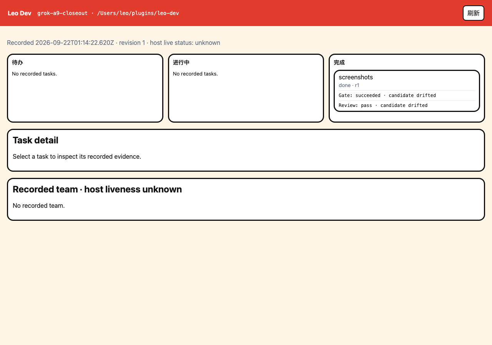

<p align="center">
  
</p>

<h1 align="center">Leo Dev</h1>
<p align="center"><strong>One <code>develop</code> entry. Work you can pick up and verify.</strong></p>
<p align="center">Grok Build first period · TypeScript + Node.js · MIT licensed</p>

Leo Dev is a plugin for an existing coding host. The host keeps the session, tools, model, permissions and sandbox. The plugin supplies one public entry (`develop`), a local lifecycle journal, and a three-column workbench that reads that journal.

The cycle is specification → plan → implementation → independent review → evidence bound to the current tree. Questions and read-only inspection do not open a ledger. Any product-code change uses the full cycle. Stages do not force TDD, worktrees or a second branded workflow. Independent review is a host subagent with a different session id, not a second window and not the implementer switching roles. Repair continues until the review passes or the same findings stop progress. After a pass you can commit locally; push still needs an explicit request. `integration-review` is not release-ready.

On Grok, install the plugin and call **`$develop`**. On Codex, the packaged entry is **`$leo-dev:develop`**.

<p align="center">
  
</p>

## Why it exists

- **One entry.** You do not pick a second workflow plugin. Useful methods are absorbed into `develop`; they are not user-facing brands.
- **Keep approved intent.** After goals are aligned and you say to start, you do not re-approve the spec file unless the goal changed.
- **Independent review.** A host subagent, with a session id that is not the implementer's. Same window, different role does not count. See [Independent review](#independent-review).
- **Repair without a count cap.** Failed reviews stay in repair until they pass, or until unchanged findings mean no progress. There is no 2+1 attempt budget.
- **Honest evidence.** Passed, failed, not run and blocked stay distinct. A recorded pass that no longer matches the tree is drifted, not current.
- **Local commit only.** `leo-dev commit` records a local git commit and never pushes.

Leo Dev is a workflow and local integrity mechanism. The host sandbox, permissions and external CI remain authoritative. See [security boundaries](SECURITY.md).

## Start from source

Use **Node.js 22** for source development and quality checks, plus npm and Git. The packaged controller retains its Node.js 20-or-newer runtime contract.

```sh
git clone https://github.com/leopaisen-zb/leo-dev.git
cd leo-dev
npm ci
npm run build
npm run typecheck
npm run lint:quality
npm test
npm run test:quality-coverage
npm run build:adapters
npm run verify:packages
```

`dist/open-agent-plugin/leo-dev` is the Grok / Open Agent plugin: skill `develop`, its references, and the compiled controller under `runtime/`. `dist/codex/leo-dev` is the Codex package (skill, selected upstream resources and the compiled controller). Install from those directories with the host's plugin command; see [installation](docs/installation.md). A skill file on disk is not the same check as a new host session loading it.

The quality checks focus on design admission and the relevant recovery behavior. Required test failures and scoped lint errors fail the check; coverage is reporting-only while the first baseline is reviewed. CLI tests execute compiled child processes, so worker-process V8 coverage does not represent all behavior those tests exercise. Historical verification copies are excluded from test discovery.

## Use the workflow

```text
$develop Build the approved feature in this repository.
Reuse the existing specification, complete the implementation and checks,
get an independent review, and report the actual evidence.
```

For an interrupted task:

```text
$develop Continue the current change.
Inspect durable state and the actual working tree before taking a new lease.
Preserve unrelated edits and do not reuse stale review evidence.
```

The controller serializes tasks. Host subagents provide the implementation and review sessions. It does not start a background agent service.

See the [lifecycle and command guide](skills/develop/references/lifecycle.md). Codex-only team members are documented in [codex-team](skills/develop/references/codex-team.md) and do not apply on other hosts.

## Independent review

Leo Dev does not open a second window and does not schedule sessions. The host already owns subagents; the plugin only records who implemented and who reviewed.

1. The implementer claims the task with `leo-dev claim --session <implementer-id>`.
2. After gates, `leo-dev submit` binds the candidate. The same process asks the **host** to start a reviewer subagent: Grok `spawn_subagent`, Codex agent/thread, Claude Task. That child has its own session id.
3. The reviewer writes a receipt. `leo-dev review --receipt` accepts it only when provenance is `platform-attested` or `human-confirmed`, both session ids are nonempty, and they differ. `agent-asserted` is never independent. A same-session receipt is CONFLICT; it is not recorded as a failed review.

Switching roles in the current window does not count. If the host has no subagent, stop and ask a person, or take a `human-confirmed` receipt. Do not install another workflow plugin to get a second session.

A later repair needs a **new** reviewer session; an old pass cannot be reused. `REVIEW_REJECTED` means the reject was recorded and the task went back to repair, not that delivery succeeded.

Normative text: [host-subagents](skills/develop/references/host-subagents.md), [review protocol](skills/develop/references/review-protocol.md). The controller check is `independentReviewSession` in `packages/cli/src/state/commit-pass.ts`, used by `leo-dev review`.

## Inspect task state

The local read-only workbench projects one change from the journal onto three columns: **待办**, **进行中** and **完成**. Review is a card badge (审查中 / 审查未过), not a fourth column. Gate and review verdicts are shown on the card; whether that evidence still matches the current tree is a separate field (`matches` / `drifted` / `unknown`).

<p align="center">
  
</p>

This capture is change `grok-a9-closeout` after the task landed in 完成. The card shows a recorded pass whose candidate has since drifted. The [narrow view](assets/leo-dev-board-mobile.png) stacks the same three columns. Title in the HTML document is **Leo Dev 看板**; the header control is **刷新**.

```sh
node packages/cli/dist/index.js board --repo /absolute/path/to/project --change your-change-id
```

Open the printed localhost URL and use **刷新** to read the latest observation. Selecting a task shows its recorded details. A failed refresh marks the previous display stale; old green evidence is not a fresh check. Host liveness stays **unknown**. The board does not start agents, edit tasks, or write the journal. See the [board guide](docs/board.md).

## Meet Mochi Board

A localhost example with persistent tasks, three workflow columns, priority and text filters, import/export, and recent activity. Its application data is independent of the controller journal.

<p align="center">
  
</p>

The same example adapts to a [390-pixel mobile viewport](assets/mochi-board-mobile.png). Both images come from an independent browser run.

```sh
node examples/mochi-board/server.mjs
```

Open `http://127.0.0.1:4173`. Data stays in the example's local `.data/` directory. To use a different file or port:

```sh
node examples/mochi-board/server.mjs --port 4174 --data /absolute/path/board.json
```

The [example requirements](examples/mochi-board/docs/spec-v2.md) describe that app. See [recorded results](docs/release-evidence.md) for what that exercise actually ran.

## How it relates to other methods

Users do not choose a second workflow by brand name. Planning, review and recovery behavior that Leo Dev keeps is written into `develop` and the local controller. Pinned upstream files that remain in the package are license and provenance records, not extra entries; see [NOTICE](NOTICE) and [provenance](skills/develop/references/upstream/provenance.json).

The [benchmark guide](docs/benchmarks.md) describes a historical comparison. Those numbers are not a v2 completion gate.

## Support boundary

**Grok Build is the first-period run and accept host** (spec 2.1.1). Codex remains on the design list and does not block this period. Claude Code, Qoder and DeepSeek adapters are packaging or shape work, not first-period gates. Cursor is out of this period. Grok marketplace browse-install was not the discovery check; a local `grok plugin install` plus a new session was.

See [spec 2.1.1](.scratch/modern-harness/spec.md), [first-period acceptance](.scratch/modern-harness/acceptance.md), and [release evidence](docs/release-evidence.md) for what was executed versus not run. Native-mobile and AI/RAG-specific acceptance remain separate work.

Contributors can use the [development guide](CONTRIBUTING.md). Private local histories, credentials, old approval receipts, generated caches and raw session evidence are excluded from the distribution.

## License and artwork

Original project code and documentation are licensed under the **[MIT License](LICENSE)**. Included upstream resources retain their own licenses; see [NOTICE](NOTICE). The Shin-chan illustration is fan art, excluded from the MIT grant, with no official affiliation or endorsement. Third-party character and trademark rights remain with their respective holders. See [artwork details](assets/README.md).
